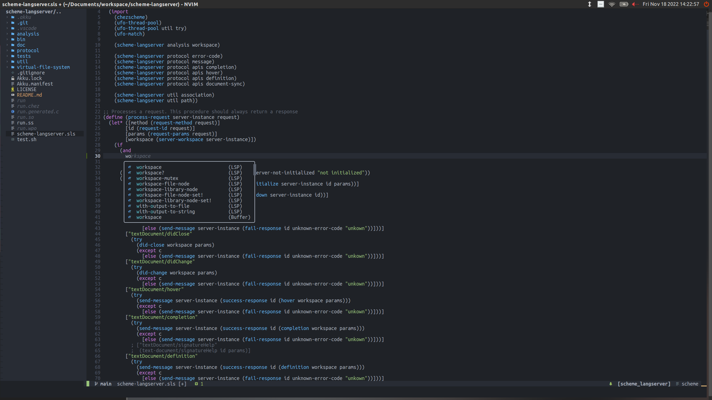

# Overview

Implementing support like autocomplete, goto definition, or documentation on hover is a significant effort for programming. However, comparing to other language like java, python, javascript and c, language server protocol implementation for lisp language are just made in a vacuum. [Geiser](https://gitlab.com/emacs-geiser), [racket language server](https://github.com/theia-ide/racket-language-server) and [swish-lint](https://github.com/becls/swish-lint) etc., their works are all based on `repl`(Read-Eval-Print Loop) or keyword tokenizer instead of programming. For example, if a programmer was coding on an unaccomplished project, in which the codes are not fully runnable, [Geiser](https://gitlab.com/emacs-geiser) or any others would only complete top-level binding identifiers listed by `environment-symbols` procedure (for [Chez](https://cisco.github.io/ChezScheme/)). Which means for local bindings and unaccomplished codes, though making effort for programming is supposed of the importance mostly, [Geiser](https://gitlab.com/emacs-geiser) and its counterparts help nothing. Familiar cases occur with goto definition and many other functionalities.

A primary cause is, for scheme and other lisp dialects, their abundant data sets and flexible control structures raise program analysis a big challenge. In fact, scheme even don't have commonly acknowledged project management frameworks and [corresponding extension system](https://stackoverflow.com/questions/36240629/whats-the-proper-scheme-file-extension). As for extensions SS, and SCM, most programmers suppose their codes are writing for a running environment and don't provide any library information. Although with [Akku](https://akkuscm.org/) and [Snow](http://snow-fort.org/), SLS and SLD files can base a project on a stable library framework, `involve`, `load` and many other procedures which maintain dynamic library linkages make static code analysis telling less.

This package is a language server protocol implementation helping scheme programming. It provides completion, definition and will provide many other functionalities. These functionalities are established on static code analysis with [r6rs standard](http://www.r6rs.org/) and some obvious rules for unaccomplished codes. This package itself and related libraries are published or going to be published with [Akku](https://akkuscm.org/), which is a package manager for Scheme. 

This package also has been tested with [Chez Scheme](https://cisco.github.io/ChezScheme/) versions 9.4 and 9.5.

Your donation will make this world better. Also, you can issue your advice and I might implement if it was available.

[](https://www.paypal.com/paypalme/ufo5260987423/10)

# Setup
## Building
### Pre-require
1. [Chez Scheme](https://cisco.github.io/ChezScheme/);
>NOTE
If you wanted to enable scheme-langserver's muti-thread feature, it would require [Chez Scheme](https://cisco.github.io/ChezScheme/) to have been compiled with the --threads option. This uses chez scheme's FFI to call up the pipe() and poll() system calls, and therefore requires a UNIX-like operating system to function correctly.  It has been tested with linux and should work on the BSDs and on Mac OS X. If using OS X, the glibtool package will be required.
2. [Akku](https://akkuscm.org/)；
3. [chez-exe](https://github.com/gwatt/chez-exe)；
>NOTE
[chez-exe](https://github.com/gwatt/chez-exe) requires boot files and kernel files of [Chez Scheme](https://cisco.github.io/ChezScheme/). So, the compile command maybe like follows:`scheme --script gen-config.ss --bootpath /path-to-ChezScheme/{machine-type}/boot/{machine-type}`

### For Linux
```bash
git clone https://github.com/ufo5260987423/scheme-langserver
cd scheme-langserver
akku install
bash .akku/env
compile-chez-program run.ss
./run path-to-logfile
```
### TODO: for Windows

## Installation for [LunarVim](https://www.lunarvim.org/)
In the near future, I will pull request to [mason.nvim](https://github.com/williamboman/mason.nvim) and [mason-lspconfig.nvim](https://github.com/williamboman/mason-lspconfig.nvim). In that case, you will be able to get this implementation automatically with [LunarVim](https://www.lunarvim.org/).

But now, for installed plugin [nvim-lspconfig](https://github.com/neovim/nvim-lspconfig/), we have to manually do some installation: after manually building from above step [Building](#building), an executable file `run`  would be available at `{path-to-run}`. Then, create file `~/.local/share/lunarvim/site/pack/packer/start/nvim-lspconfig/lua/lspconfig/server_configurations/scheme_langserver.lua` as follows:
```lua
local util = require 'lspconfig.util'
local bin_name = '{path-to-run}'
local cmd = { bin_name }

return {
  default_config = {
    cmd = cmd,
    filetypes = { 'scheme' },
    root_dir = util.find_git_ancestor,
    single_file_support = true,
  },
  docs = {
    description = [[
https://github.com/ufo5260987423/scheme-langserver
`scheme-langserver`, a language server protocol implementation for scheme
]]   ,
  },
}
```
Then configure your `~/.config/lvim/init.lua` and add following codes like:
```lua
require 'lspconfig'.scheme_langserver.setup {}
```

>NOTE
For LunarVim, default scheme file extension doesn't include ".SLS". A patch to `.local/share/lunarvim/lvim/ftdetec/` is to add `sls.lua` file as following:
```lua
vim.cmd [[ au BufRead,BufNewFile *.sls set filetype=scheme ]]
```

## TODO: Installation for [VScode](https://code.visualstudio.com/)

# Status 

This project is still in early development, so you may run into rough edges with any of the features. The following list shows the status of various features.

## Features
1. Top-level and local identifiers binding completion.

2. Goto definition.
3. Compatible with package manager: Akku.
4. File changes synchronizing and corresponding index changing.

## TODOs

5. Renaming.
6. *-syntax(define-syntax, let-syntax, etc.) based identifier binding extension.
7. Fully compatible with r6rs standard.
8. Cross-platform Parallel indexing.
9. Macro expanding.
10. Code eval.
11. Code diagnostic.
12. Add cross-language semantic supporting.

# Contributing 

# Debug
Following tips from [Building](#building), [Installation for Lunar Vim](#installation-for-lunarvim) and [Installation for VScode](#todo-installation-for-vscode), if anyone wants to do some developing and log something, it will be convenient to add `path-to-log-file` and re-write file `~/.local/share/lunarvim/site/pack/packer/start/nvim-lspconfig/lua/lspconfig/server_configurations/scheme_langserver.lua` as follows:
```lua
local util = require 'lspconfig.util'
local bin_name = '{path-to-run}'
local cmd = { bin_name ,"path-to-log-file"}

return {
  default_config = {
    cmd = cmd,
    filetypes = { 'scheme' },
    root_dir = util.find_git_ancestor,
    single_file_support = true,
  },
  docs = {
    description = [[
https://github.com/ufo5260987423/scheme-langserver
`scheme-langserver`, a language server protocol implementation for scheme
]]   ,
  },
}

# Test
> bash test.sh
