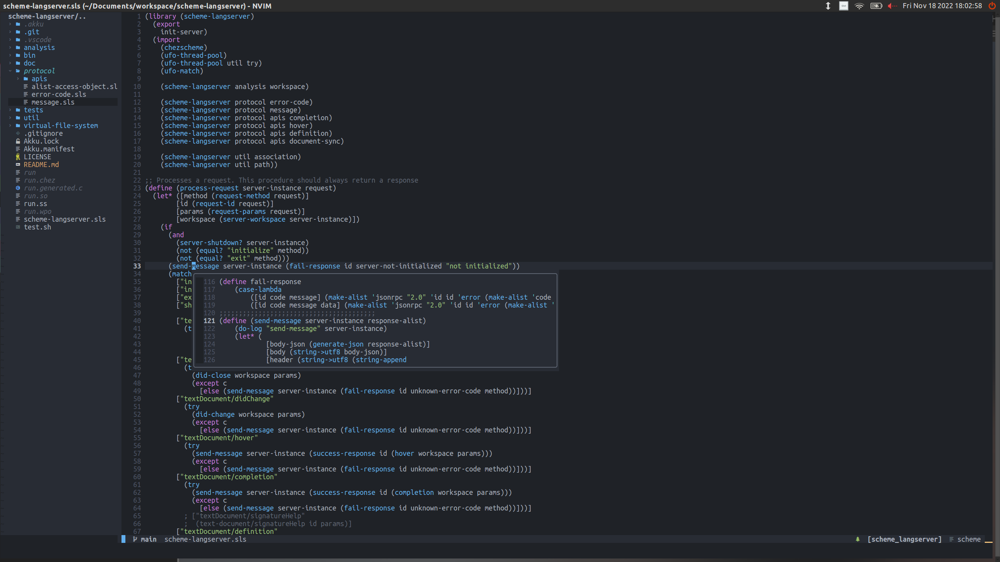
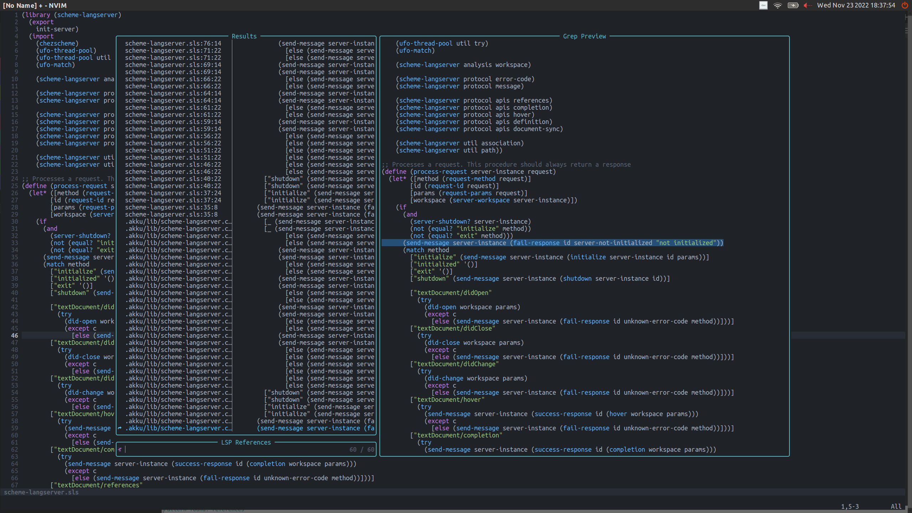
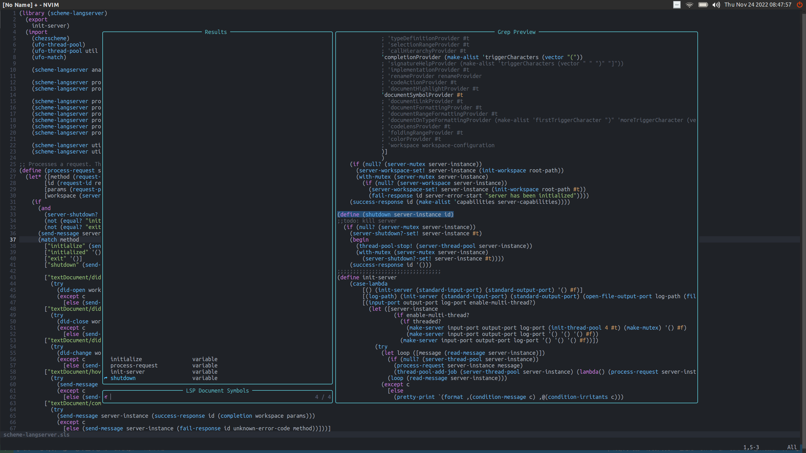

# Scheme-langserver

Implementing support like autocomplete, goto definition, or documentation on hover is a significant effort for programming. However, comparing to other language like java, python, javascript and c, language server protocol implementation for lisp language are just made in a vacuum. [Geiser](https://gitlab.com/emacs-geiser), [racket langserver](https://github.com/jeapostrophe/racket-langserver) and [swish-lint](https://github.com/becls/swish-lint) etc., their works are all based on `repl`(Read-Eval-Print Loop) or keyword tokenizer instead of programming. For example, if a programmer was coding on an unaccomplished project, in which the codes are not fully runnable, [Geiser](https://gitlab.com/emacs-geiser) or any others would only complete top-level binding identifiers listed by `environment-symbols` procedure (for [Chez](https://cisco.github.io/ChezScheme/)). Which means for local bindings and unaccomplished codes, though making effort for programming is supposed of the importance mostly, [Geiser](https://gitlab.com/emacs-geiser) and its counterparts help nothing. Familiar cases occur with goto definition and many other functionalities.

A primary cause is, for scheme and other lisp dialects, their abundant data sets and flexible control structures raise program analysis a big challenge. In fact, scheme even don't have commonly acknowledged project management frameworks and [corresponding extension system](https://stackoverflow.com/questions/36240629/whats-the-proper-scheme-file-extension). As for extensions SS, and SCM, most programmers suppose their codes are writing for a running environment and don't provide any library information. Although with [Akku](https://akkuscm.org/) and [Snow](http://snow-fort.org/), SLS and SLD files can base a project on a stable library framework, `load`, `load-program` and many other procedures which maintain dynamic library linkages make static code analysis telling less.

This package is a language server protocol implementation helping scheme programming. It provides completion, definition and will provide many other functionalities for SLS and SLD files. These functionalities are established on static code analysis with [r6rs standard](http://www.r6rs.org/) and some obvious rules for unaccomplished codes. This package itself and related libraries are published or going to be published with [Akku](https://akkuscm.org/), which is a package manager for Scheme. 

This package also has been tested with [Chez Scheme](https://cisco.github.io/ChezScheme/) versions 9.4 and 9.5.

Your donation will make this world better. Also, you can issue your advice and I might implement if it was available.
[](https://www.paypal.com/paypalme/ufo5260987423/10)

>NOTE: 
This implementation is mainly appliable for .sls and .sld files, because .ss and .sps suppose that they're executing in a running virtual machine. [A detailed discussion](https://github.com/ufo5260987423/scheme-langserver/discussions/27) is now running.

## Recent Status
I'm now would have a one-month break, so tired and poor. In the future I have a plan of user-friendly diagnostic information and type inference rules for higher-order procedures like `car`. And I'm still calling for donation.

## Log
1.0.11: Gradual Typing system, all basic rules have been passed (you can verify it with `test/analysis/type/*.sps` and `test/analysis/type/rules/*.sps`). Detailed documentation has been published. 

1.0.10: Fix bugs in 1.0.9.

1.0.9: Abandoned: add parallel and synchronize mechanism, which can harshly speed up indexing.

1.0.8: Build index as document synchronizing instead of workspace initializing.

1.0.7: Catch syntax-* identifier bindings.

## Setup
### Building
#### Pre-require
1. [Chez Scheme](https://cisco.github.io/ChezScheme/);
>NOTE
If you wanted to enable scheme-langserver's muti-thread feature, it would require [Chez Scheme](https://cisco.github.io/ChezScheme/) to have been compiled with the --threads option. I've test multi-thread feature for Linux, and according to [this page](https://github.com/cisco/ChezScheme/blob/main/BUILDING), it will also excutable for Windows.
2. [Akku](https://akkuscm.org/)；
3. [chez-exe](https://github.com/gwatt/chez-exe)；
>NOTE
[chez-exe](https://github.com/gwatt/chez-exe) requires boot files and kernel files of [Chez Scheme](https://cisco.github.io/ChezScheme/). So, the compile command maybe like follows:`scheme --script gen-config.ss --bootpath /path-to-ChezScheme/{machine-type}/boot/{machine-type}`

#### For Linux
```bash
git clone https://github.com/ufo5260987423/scheme-langserver
cd scheme-langserver
akku install
bash .akku/env
compile-chez-program run.ss
./run path-to-logfile
```
#### TODO: for Windows
The `run` file is also executable for windows WSL environment, and I'm waiting for [Chez Scheme 10](https://github.com/cisco/ChezScheme/wiki/Announcements). As their announcement, they will merge the racket implemented [Chez Scheme](https://cisco.github.io/ChezScheme/) into main branch. And in [this page](https://github.com/racket/ChezScheme/blob/master/BUILDING) it seems that the racket implementation has solved the multi-thread problem.

### Installation for [LunarVim(1.3)](https://www.lunarvim.org/)
I have pull request to [mason.nvim](https://github.com/williamboman/mason.nvim) and [mason-lspconfig.nvim](https://github.com/williamboman/mason-lspconfig.nvim). In that case, you can get this implementation automatically with [LunarVim](https://www.lunarvim.org/). 

But now, above configuration haven't been tested. So, manual installation is still needed: for installed plugin [nvim-lspconfig](https://github.com/neovim/nvim-lspconfig/), after manually building from above step [Building](#building), an executable file `run` would be available at `{path-to-run}`. Then, create file `~/.local/share/lunarvim/site/pack/lazy/opt/nvim-lspconfig/lua/lspconfig/server_configurations/scheme_langserver.lua` as follows:
```lua
local util = require 'lspconfig.util'
local bin_name = '{path-to-run}'
local cmd = { bin_name }

return {
  default_config = {
    cmd = cmd,
    filetypes = { 'scheme' },
    root_dir = util.find_git_ancestor,
    single_file_support = true,
  },
  docs = {
    description = [[
https://github.com/ufo5260987423/scheme-langserver
`scheme-langserver`, a language server protocol implementation for scheme
]]   ,
  },
}
```

Then configure your `~/.config/lvim/config.lua` and add following codes like:
```lua
vim.cmd [[ au BufRead,BufNewFile *.sld set filetype=scheme ]]
vim.cmd [[ au BufRead,BufNewFile *.sls set filetype=scheme ]]

vim.api.nvim_create_autocmd('LspAttach', {
  group = vim.api.nvim_create_augroup('UserLspConfig', {}),
  callback = function(ev)
    -- Enable completion triggered by <c-x><c-o>
    vim.bo[ev.buf].omnifunc = 'v:lua.vim.lsp.omnifunc'

    -- Buffer local mappings.
    -- See `:help vim.lsp.*` for documentation on any of the below functions
    local opts = { buffer = ev.buf }
    vim.keymap.set('n', 'gD', vim.lsp.buf.declaration, opts)
    vim.keymap.set('n', 'gd', vim.lsp.buf.definition, opts)
    vim.keymap.set('n', 'K', vim.lsp.buf.hover, opts)
    -- vim.keymap.set('n', 'gi', vim.lsp.buf.implementation, opts)
    -- vim.keymap.set('n', '<C-k>', vim.lsp.buf.signature_help, opts)
    -- vim.keymap.set('n', '<space>wa', vim.lsp.buf.add_workspace_folder, opts)
    -- vim.keymap.set('n', '<space>wr', vim.lsp.buf.remove_workspace_folder, opts)
    -- vim.keymap.set('n', '<space>wl', function()
    --   print(vim.inspect(vim.lsp.buf.list_workspace_folders()))
    -- end, opts)
    -- vim.keymap.set('n', '<space>D', vim.lsp.buf.type_definition, opts)
    -- vim.keymap.set('n', '<space>rn', vim.lsp.buf.rename, opts)
    -- vim.keymap.set({ 'n', 'v' }, '<space>ca', vim.lsp.buf.code_action, opts)
    vim.keymap.set('n', 'gr', vim.lsp.buf.references, opts)
    -- vim.keymap.set('n', '<space>f', function()
    --   vim.lsp.buf.format { async = true }
    -- end, opts)
  end,
})

-- local capabilities = vim.lsp.protocol.make_client_capabilities()
-- capabilities = require("cmp_nvim_lsp").default_capabilities(capabilities)
local lspconfig = require('lspconfig')
lspconfig.scheme_langserver.setup {}
lvim.builtin.cmp.enabled()
lvim.builtin.cmp.sources = {
  { name = 'nvim_lsp' },
  { name = 'luasnip' },
  { name = 'buffer' },
}
```
>NOTE: detailed configuration for `lvim.builtin.cmp.sources` can refer [this page](https://github.com/LunarVim/LunarVim/blob/b1c72541549d042487510ad3e676de7af046d410/lua/lvim/core/cmp.lua#L133).

### Enable Multi-thread Response and Indexing
Current scheme-langserver haven't been fully tested in multi-thread scenario, and corresponding functionalities is default disabled. Please make sure you'd truly want to enable multi-thread features and the following changes were what you wanted.

Taking [LunarVim](https://www.lunarvim.org/) as an example, steping [above instructions](#installation-for-lunarvim) and rewrite file `~/.local/share/lunarvim/site/pack/lazy/opt/nvim-lspconfig/lua/lspconfig/server_configurations/scheme_langserver.lua` as follows:
```lua
local util = require 'lspconfig.util'
local bin_name = '{path-to-run}'
local cmd = { bin_name ,'{path-to-log}','enable'}

return {
  default_config = {
    cmd = cmd,
    filetypes = { 'scheme' },
    root_dir = util.find_git_ancestor,
    single_file_support = true,
  },
  docs = {
    description = [[
https://github.com/ufo5260987423/scheme-langserver
`scheme-langserver`, a language server protocol implementation for scheme
]]   ,
  },
}
```

### TODO: Installation for [VScode](https://code.visualstudio.com/)

## Status 

This project is still in early development, so you may run into rough edges with any of the features. The following list shows the status of various features.

### Features
1. Top-level and local identifiers binding completion.

2. Goto definition.

3. Compatible with package manager: Akku.
4. File changes synchronizing and corresponding index changing.
5. Hover.
6. References and document highlight (document-scoped references).

7. Document symbol.

8. Catching *-syntax(define-syntax, let-syntax, etc.) based local identifier binding. 
9. Cross-platform parallel indexing.
10. Self-made source code annotator to be compatible with .sps files.
11. Peephole optimization for API requests.
12. Type inference.

### TODOs

13. Virtual identifier catching machine for .sps, .ss, .scm files.
14. Renaming. 
15. Fully compatible with [r6rs standard](http://www.r6rs.org/).
16. Macro expanding.
17. Code eval.
18. Code diagnostic.
19. Add cross-language semantic supporting. Well, would java, c, python and many other languages can be supported with an AST transformer?

## TODO:Contributing 

## Debug

### How to Debug
https://www.scheme.com/debug/debug.html#g1

### Output Log
Following tips from [Building](#building), [Installation for Lunar Vim](#installation-for-lunarvim) and [Installation for VScode](#todo-installation-for-vscode), if anyone wants to do some developing and log something, it will be convenient to add `path-to-log-file` and re-write file `~/.local/share/lunarvim/site/pack/packer/start/nvim-lspconfig/lua/lspconfig/server_configurations/scheme_langserver.lua` as follows:
```lua
local util = require 'lspconfig.util'
local bin_name = '{path-to-run}'
local cmd = { bin_name ,"path-to-log-file"}

return {
  default_config = {
    cmd = cmd,
    filetypes = { 'scheme' },
    root_dir = util.find_git_ancestor,
    single_file_support = true,
  },
  docs = {
    description = [[
https://github.com/ufo5260987423/scheme-langserver
`scheme-langserver`, a language server protocol implementation for scheme
]]   ,
  },
}
```
### Recurring with Log 
With above [output log](#output-log), you may use `tests/log-debug.sps` recurring bugs:
1. Rename `{path-to-log}`(usually `~/scheme-langserver.log`) as `~/ready-for-analyse.log`;
2. run `scheme --script tests/log-debug.sps`. If you want to re-produce the multi-thread environment, it would also be available to run `scheme --script tests/log-debug.sps`.

## Test
Almost all key procedures and APIs are tested. My work is just so rough but useful, maybe you would like to find what I've done in `tests` directory or just run following command in `{scheme-langserver-root-directory}`
``` bash
bash test.sh
```
>NOTE
It's hard to do test with threaded environment. So, current tests focus on single thread.

## Code Count
```bash
find . -name "*.sls" ! -path "./.akku/*" |xargs wc -l
```
## Detailed Document
1. [Catching identifier bindings](./doc/analysis/identifier.md)
2. [Synchronizing](./doc/util/synchronize.md)
3. [Type inference](./doc/analysis/type-inference.md), [类型推断](./doc/analysis/type-inference.cn.md)
4. [API Analysis](./doc/protocol/analysis.md)
